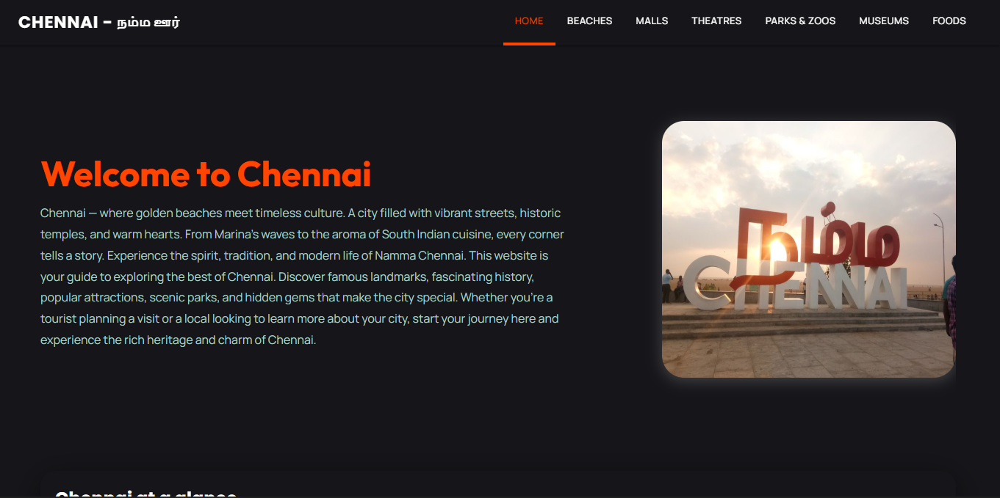
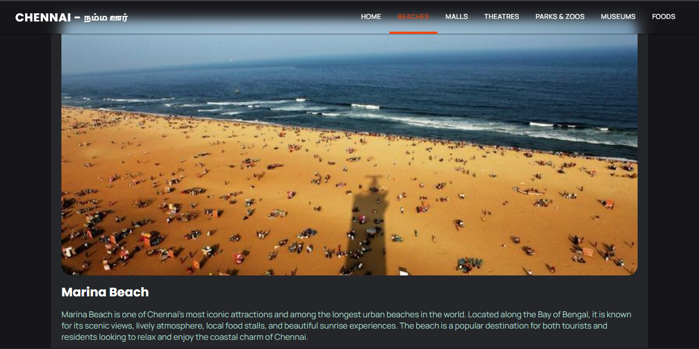
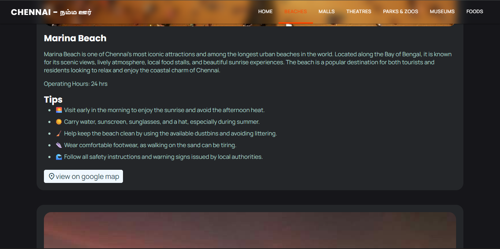
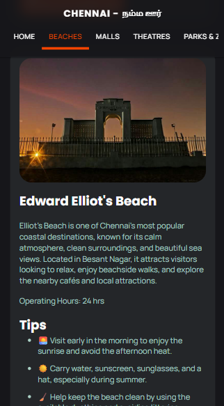

# Explore Chennai




Explore Chennai is a full-stack web application that I independently designed and developed to help users discover some of the city's most popular attractions. The project was built with two goals: to create a useful platform for exploring Chennai's beaches, parks, museums, malls, theatres, and food streets, and to strengthen my full-stack development skills using the MERN stack.

The application provides detailed information about each location through a clean, responsive, and user-friendly interface.


## 🚀 Live Demo

🌐 **Live Website:** https://explore-chennai-tan.vercel.app/

💻 **GitHub Repository:** https://github.com/mariyaprakash-collab/explore-chennai


## ✨ Features

- Explore Chennai through six curated categories: Beaches, Malls, Theatres, Parks & Zoos, Museums, and Food Streets.
- Browse places through a simple and intuitive category-based navigation.
- View detailed information for each attraction, including an image, overview, location, operating hours, and visitor tips.
- Category pages dynamically fetch place information from a Node.js and Express.js backend powered by MongoDB.
- Fully responsive design optimized for desktop, tablet, and mobile devices.


## 🛠️ Tech Stack

### Frontend
- React
- React Router
- Framer Motion
- CSS
- Vite

### Backend
- Node.js
- Express.js

### Database
- MongoDB
- Mongoose

### Other Tools
- CORS
- Dotenv
- Git
- GitHub
- Vercel (Frontend Deployment)
- Render (Backend Deployment)


## 📸 Screenshots

### Home Page


### Beaches Category



### Place Details



### Mobile Responsive View




## 📂 Project Structure

```text
explore-chennai/
├── backend/              # Express.js backend
│   ├── config/           # Database configuration
│   ├── controllers/      # Request handlers
│   ├── models/           # MongoDB models
│   ├── routes/           # API routes
│   ├── server.js         # Backend entry point
│   └── package.json
│
├── client/               # React frontend
│   ├── public/
│   ├── src/              # Components, pages, assets
│   ├── vite.config.js
│   └── package.json
│
├── screenshots/          # Images used in the README
└── README.md
```


## ⚙️ Installation

### 1. Clone the repository

```bash
git clone https://github.com/mariyaprakash-collab/explore-chennai.git
cd explore-chennai
```

### 2. Install dependencies

#### Backend

```bash
cd backend
npm install
```

#### Frontend

```bash
cd client
npm install
```

### 3. Configure Environment Variables

Create a `.env` file in the **backend** directory:

```env
MONGO_URI=your_mongodb_connection_string
PORT=5000
```

Create a `.env` file in the **client** directory:

```env
VITE_API_URI=your_backend_api_url
```

### 4. Start the application

#### Backend

```bash
cd backend
node server.js
```

#### Frontend

```bash
cd client
npm run dev
```

Open the application in your browser at:

```text
http://localhost:5173
```


## 🔮 Future Improvements

- Develop an admin dashboard to add, update, and manage places without directly modifying the database.
- Integrate an AI-powered chatbot to help users discover attractions and answer questions about Chennai.


## 👨‍💻 Author

**Mariya Prakash**

- GitHub: https://github.com/mariyaprakash-collab
- LinkedIn: https://www.linkedin.com/in/mariyaprakash